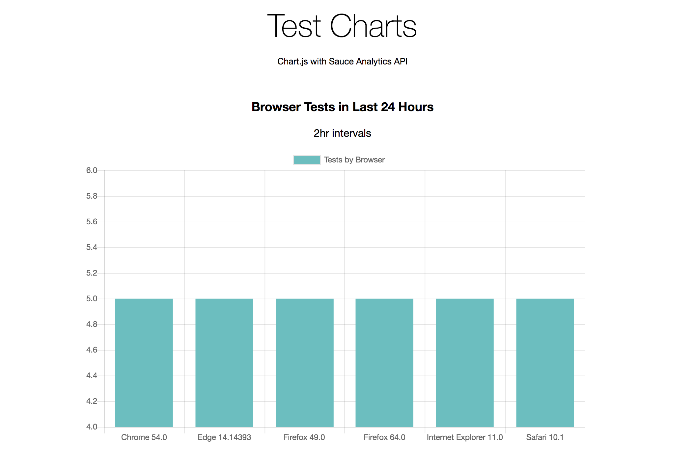

# Exercise 5: Analytics API and Data Visualization

In this exercise we use the analytics API, specifically the `trends` and `test-metrics` endpoints, to visualize our data and gain insights from out test runs.

In order to complete this exercise we need to import the [chart.js](https://www.chartjs.org/) library.

##### Example Manual Requests:

###### Query tests that ran in 1 hour intervals for the past 24 hours:

```
curl -u $SAUCE_USERNAME:$SAUCE_ACCESS_KEY \
"https://saucelabs.com/rest/v1/analytics/trends/tests?interval=1h&time_range=1d" | jq
```

###### Response:
This is the response if there were no test runs in the past 24 hours:
```
{
  "meta": {
    "status": 200
  },
  "buckets": [],
  "metrics": {
    "browser": {},
    "error": {},
    "fail": {},
    "os": {},
    "owner": {},
    "status": {
      "complete": 127,
      "errored": 0,
      "failed": 0,
      "passed": 0
    }
  }
}
```

This is an example response with actual test data:

```
{
  "meta": {
    "status": 200
  },
  "buckets": [
    {
      "timestamp": 1552672800000,
      "datetime": "2019-03-15T18:00:00.000Z",
      "count": 12,
      "aggs": {
        "browser": [
          {
            "name": "Chrome 54.0",
            "count": 2
          },
          {
            "name": "Edge 14.14393",
            "count": 2
          },
          {
            "name": "Firefox 49.0",
            "count": 2
          },
          {
            "name": "Firefox 64.0",
            "count": 2
          },
          {
            "name": "Internet Explorer 11.0",
            "count": 2
          },
          {
            "name": "Safari 10.0",
            "count": 2
          }
        ],
        "browserError": [],
        "browserFail": [],
        "os": [
          {
            "name": "Windows 10",
            "count": 4
          },
          {
            "name": "Windows 7",
            "count": 4
          },
          {
            "name": "OS X El Capitan (10.11)",
            "count": 2
          },
          {
            "name": "OS X Yosemite (10.10)",
            "count": 2
          }
        ],
        "osError": [],
        "osFail": [],
        "owner": [
          {
            "name": "xxxxxx",
            "count": 12
          }
        ],
        "status": [
          {
            "name": "passed",
            "count": 12
          }
        ]
      }
    }
  ],
  "metrics": {
    "browser": {
      "Chrome 54.0": 2,
      "Edge 14.14393": 2,
      "Firefox 49.0": 2,
      "Firefox 64.0": 2,
      "Internet Explorer 11.0": 2,
      "Safari 10.0": 2
    },
    "error": {},
    "fail": {},
    "os": {
      "OS X El Capitan (10.11)": 2,
      "OS X Yosemite (10.10)": 2,
      "Windows 10": 4,
      "Windows 7": 4
    },
    "owner": {
      "jtack4970": 12
    },
    "status": {
      "complete": 0,
      "errored": 0,
      "failed": 0,
      "passed": 12
    }
  }

```
##### Example Programmatic Request:
In this example we will:
* Get the `trends` API data
* Count the amount of browsers and browser failures
* Display the data using `chart.js`

## Part One: `getTrends`

1. Checkout branch `05_analytics_api`
2. Open `js-examples/trends.js` and create the following constants:
    ```
    const username = process.env.SAUCE_USERNAME;
    const accessKey = process.env.SAUCE_ACCESS_KEY;
    const trendsAPI = "saucelabs.com/rest/v1/analytics/trends/tests?interval=2h&time_range=1d";
    const sauceURL = 'https://' + username + ':' + accessKey + '@' + trendsAPI;
    const axios = require("axios");
    ```
3. Create a function expression called `getTrends` with the following `try` `catch` block:
    ```
   const getTrends = async () => {
        try {
            response = await axios.get(sauceURL)
            console.log(response.data)
            return response
        } catch (error) {
            console.log(error)
        }
    }
    ```
4. Call the function, test with `node` and check the response:
    ```
    getTrends()
    ```
    ```
    node js-examples/trends.js
    ```
    
## Part Two: `countBrowsers` and `countBrowserFailures`
1. Create a new function expression called `countBrowsers`:
    ```
    const countBrowsers = async () => {
        const browsers = await getTrends()
    }
    ```
2. Add the following promise syntax to return the `metrics` object and then target the `browser` object:
    ```
    const countBrowsers = async () => {
        const browsers = await getTrends()
            .then(response => {
                if (response.data.metrics.browser) {
                    myBrowsers = response.data.metrics.browser
                    console.log(`Got ${Object.entries(myBrowsers).length} browser types`)
                    console.log(myBrowsers)
                }
            })
            .catch(error => {
                console.log(error)
            })
    }
    ```
3. Repeat step 1 through 2 and create a similar function expression: `browserFailures`:
4. Delete the `getTrends` function call and call the new functions.
    ```
    countBrowsers()
    countBrowserFailures()
    ```
    Then check the response:
    ```
    node js-examples/trends.js
    ```
## Part Three: Using `Chart.js`

In the final step in this exercise we're going to use `chart.js` and `jquery` to display test trend data:
1. Open `js-examples/chart.js` and set the `$(document)` initialization with the following `function()`
    ```
    $(document).ready(function() {
        const options = {
            type: 'bar',
            data: {
                labels: ["Beta Value", "Charlie Value", "Delta Value"],
                datasets: [{
                    label: 'Awesome Dataset',
                    data: [ 302, 175, 50],
                    backgroundColor: "rgba(75, 192, 192, 1)"
                }]
            }
        };
    ```
2. Then set the following constants that represent static browser data:
    ```
    const testChart = new Chart($("#testChart"), options);
        const data = [
            {
                'Chrome 54.0': 5,
                'Edge 14.14393': 5,
                'Firefox 49.0': 5,
                'Firefox 64.0': 5,
                'Internet Explorer 11.0': 5,
                'Safari 10.1': 5
            }
        ];
        options.data.labels = [];
        options.data.datasets = [{
            label: 'Tests by Browser',
            data: [],
            backgroundColor: "rgba(75, 192, 192, 1)"
        }];
    ```
3. Create the following `for` loop:
    ```
    for (var i in data) {
            for (var y in data[i]) {
                if (i == 0) {
                    options.data.labels.push(y);
                }
                options.data.datasets[i].data.push(data[i][y]);
            }
        }
        testChart.update();
    });
    ```
4. Repeat the same steps to render `browserFailures`
    
    > to see the finished examples, use `git checkout 06_complete_examples`
    
5. Open `index.html` and set your script source as: `chart.js`:
    ```
    <head>
        ...
        <script src="js-examples/chart.js"></script>
        ...
    </head>
    ```
6. Launch `index.html` in a local web browser to see the chart data:
    
    